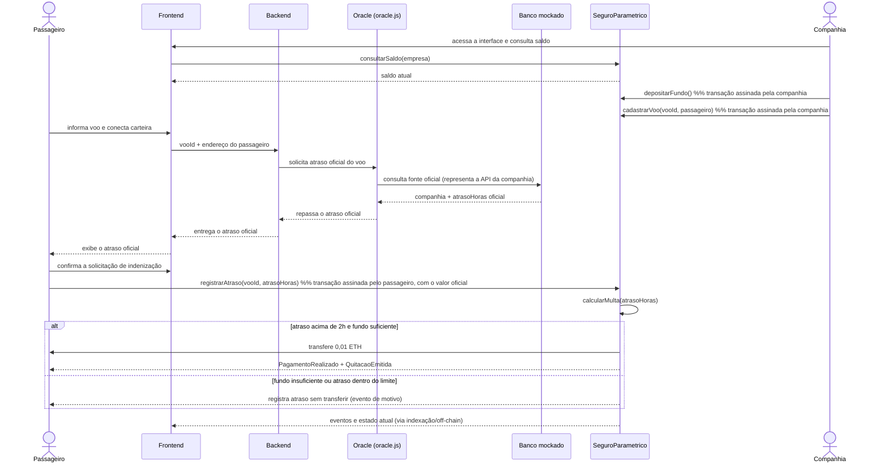

# Fluxo da função central (diagrama de sequência)

Este arquivo documenta, passo a passo, a execução da função central do
protótipo: o registro do atraso e a quitação automática. 

## Fluxo

1. A companhia consulta seu saldo pela interface e deposita o fundo de
   garantia diretamente no contrato (`depositarFundo()` é uma transação
   assinada pela própria carteira dela, sem passar pelo backend).
2. Ainda com a própria carteira, a companhia cadastra o voo chamando
   `cadastrarVoo(vooId, passageiro)` — o contrato usa `msg.sender` como
   endereço da empresa, então não é preciso (nem possível) informar a
   companhia como parâmetro.
3. O passageiro informa o voo e conecta sua carteira no frontend.
4. O backend não consulta o banco mockado diretamente: ele repassa o pedido
   ao Oracle, que é quem consulta a fonte oficial (o banco mockado,
   representando a API da companhia) e retorna o atraso oficial. O Oracle é
   puramente um componente de consulta/integração off-chain — ele não possui
   privilégios no contrato, não assina transações e não chama `cadastrarVoo`
   nem `registrarAtraso`.
5. O backend entrega o atraso oficial ao frontend, que o exibe ao passageiro.
6. O passageiro confere o valor exibido e, ao confirmar, assina com a própria
   carteira a transação `registrarAtraso(vooId, atrasoHoras)`, usando o
   atraso oficial obtido pelo Oracle.
7. O contrato calcula a multa internamente. Dependendo do resultado, a
   execução segue por um dos dois ramos do `alt`:
   - **atraso acima de 2h e fundo suficiente:** o contrato transfere a
     indenização ao passageiro e emite `PagamentoRealizado` e
     `QuitacaoEmitida`;
   - **fundo insuficiente ou atraso dentro do limite:** o atraso já ficou
     registrado, mas nenhuma transferência ocorre — a própria chamada
     retorna uma mensagem explicando o motivo.
8. O resultado (eventos e estado atualizado) pode ser lido por qualquer
   componente off-chain. As transações assinadas pelas carteiras da
   companhia e do passageiro produzem hashes que as interfaces/backends
   podem indexar e apresentar ao usuário.

