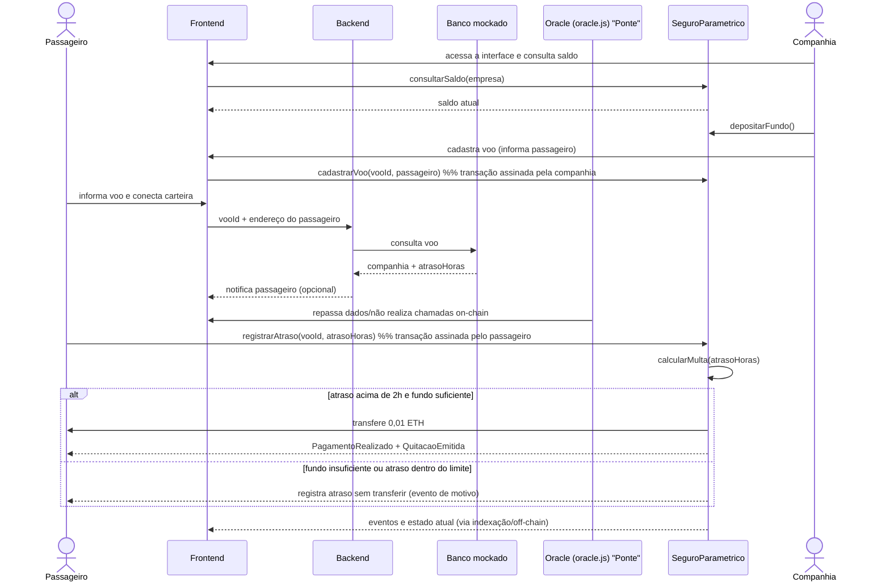

# Fluxo da função central (diagrama de sequência)

Este arquivo documenta, passo a passo, a execução da função central do
protótipo: o registro do atraso e a quitação automática. 

## Fluxo

1. A companhia consulta seu saldo pela interface e deposita o fundo de
   garantia diretamente no contrato (`depositarFundo()` é uma transação
   assinada pela própria carteira dela, sem passar pelo backend).
2. O passageiro informa o voo e conecta sua carteira no frontend.
3. O backend consulta o banco mockado para obter a companhia e o atraso do
   voo, e repassa esses dados ao Oracle.
4. O Oracle atua apenas como ponte de comunicação e não possui privilégios
   para executar transações on-chain em nome de outros atores. As chamadas
   on-chain são realizadas pelas carteiras das partes responsáveis:
   - a **companhia** chama `cadastrarVoo` (assinando a transação com sua carteira);
   - o **passageiro** chama `registrarAtraso` quando detecta/recebe o atraso.
5. O contrato calcula a multa internamente. Dependendo do resultado, a
   execução segue por um dos dois ramos do `alt`:
   - **atraso acima de 2h e fundo suficiente:** o contrato transfere a
     indenização ao passageiro e emite `PagamentoRealizado` e
     `QuitacaoEmitida`;
   - **fundo insuficiente ou atraso dentro do limite:** o atraso já ficou
     registrado, mas nenhuma transferência ocorre — o Oracle recebe apenas
     uma mensagem explicando o motivo.
6. O resultado (eventos e estado atualizado) pode ser lido por qualquer
   componente off-chain. Transações geradas pelas carteiras da companhia ou do
   passageiro produzem hashes que as interfaces/backends podem indexar e
   apresentar ao usuário.

