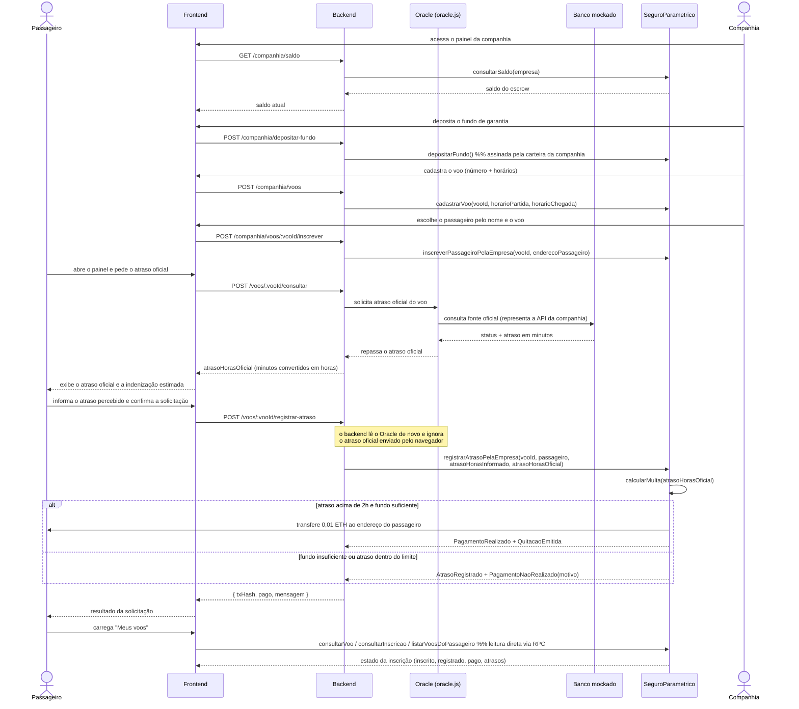

# Fluxo da função central (diagrama de sequência)

Este arquivo documenta, passo a passo, a execução da função central do
protótipo: o registro do atraso e a quitação automática.

Neste protótipo o passageiro **não possui chave privada**: ele informa apenas
o endereço que vai receber a indenização. Quem assina todas as transações é a
carteira única da companhia aérea, operada pelo backend
(`OPERATOR_PRIVATE_KEY`). O Oracle continua sendo um componente off-chain sem
nenhum privilégio no contrato.

## Fluxo

1. A companhia abre o painel; o backend lê `consultarSaldo(empresa)` no
   contrato e devolve o saldo do escrow.
2. A companhia deposita o fundo de garantia. O frontend não assina nada: ele
   chama `POST /companhia/depositar-fundo`, e o backend assina
   `depositarFundo()` com a carteira da companhia (`OPERATOR_PRIVATE_KEY`).
   O contrato usa `msg.sender` como dona do saldo.
3. Ainda pelo backend, a companhia cadastra o voo com
   `cadastrarVoo(vooId, horarioPartida, horarioChegada)` — o contrato usa
   `msg.sender` como empresa do voo.
4. A companhia escolhe um passageiro já cadastrado (pelo nome) e o inscreve
   com `inscreverPassageiroPelaEmpresa(vooId, enderecoPassageiro)`. Só a
   companhia dona do voo consegue inscrever. Um mesmo voo pode ter vários
   passageiros, cada um com estado de indenização independente.
5. No painel do passageiro, o botão "Buscar atraso oficial" chama
   `POST /voos/:vooId/consultar`. O backend não lê o banco mockado
   diretamente: ele passa pelo Oracle, que consulta a fonte oficial e retorna
   o atraso. O Oracle não tem privilégios no contrato, não assina transações
   e não aparece em nenhum `require` do Solidity.
6. O passageiro informa quantas horas acha que o voo atrasou (valor apenas
   registrado, sem efeito no pagamento) e confirma. O backend **consulta o
   Oracle de novo** e descarta o atraso oficial enviado pelo navegador —
   depois assina
   `registrarAtrasoPelaEmpresa(vooId, passageiro, atrasoHorasInformado, atrasoHorasOficial)`.
7. O contrato valida a companhia, a inscrição e a ausência de pagamento
   anterior, marca a inscrição como `registrado` e calcula a multa sobre o
   atraso oficial. A execução segue por um dos dois ramos do `alt`:
   - **atraso acima de 2h e fundo suficiente:** debita o escrow, marca
     `pago = true`, transfere a indenização ao endereço do passageiro e emite
     `PagamentoRealizado` e `QuitacaoEmitida`;
   - **fundo insuficiente ou atraso dentro do limite:** o atraso fica
     registrado, nenhuma transferência ocorre e o contrato emite
     `PagamentoNaoRealizado` com o motivo. Quando o motivo é falta de saldo, a
     interface oferece "Tentar pagamento novamente" depois que a companhia
     depositar mais fundo.
8. O backend lê os eventos do recibo da transação (não o valor de retorno, que
   não é legível depois que a transação é minerada) e devolve
   `{ txHash, pago, mensagem }` ao frontend.
9. As telas de acompanhamento leem o contrato **direto por RPC**, sem
   carteira: `consultarVoo`, `consultarInscricao`, `listarVoosDoPassageiro` e
   `calcularMulta`.

## Por que não existe uma função em que o passageiro assine

Uma versão anterior expunha `registrarAtraso(vooId, atrasoHorasInformado,
atrasoHorasOficial)` para o próprio passageiro assinar. Como o atraso oficial
entrava pelo parâmetro, qualquer endereço inscrito em um voo podia declarar um
atraso arbitrário e sacar a indenização do fundo da companhia. A função foi
removida: o único caminho de pagamento é `registrarAtrasoPelaEmpresa`, em que
o atraso oficial vem do Oracle, lido pelo backend imediatamente antes de
assinar.
