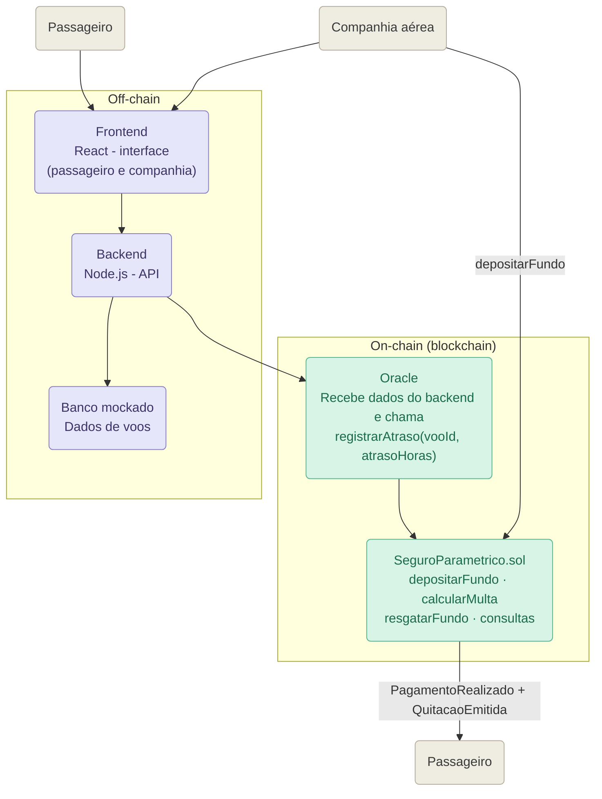

# Diagrama de arquitetura

Versão em Mermaid do diagrama original do grupo (`arquiteturaBase.jpeg`),
atualizada com os nomes e funções que estão sendo implementados. O Oracle
aparece como um componente próprio, separado do `SeguroParametrico.sol`: o
backend não chama o contrato diretamente, ele aciona o Oracle, e só o Oracle
tem permissão para escrever no contrato.

## Observação sobre a posição do Oracle no diagrama

O módulo `oracle/oracle.js` roda fora da blockchain, como um script Node.js
comum — ele não é um smart contract. Ele é desenhado dentro da caixa
"On-chain" apenas para representar seu papel: é a única peça do sistema que
tem permissão para gravar dados no contrato. Todo o resto do fluxo (frontend,
backend, banco mockado) nunca toca o contrato diretamente.

## Observação sobre o frontend da companhia aérea

O mesmo Frontend React atende os dois atores externos. O passageiro o usa
para informar o voo; a companhia o usa para consultar saldo/voos e para
disparar o `depositarFundo()`. Por isso existe uma seta de `Companhia` para
`Frontend` (interação off-chain, pela interface) além da seta de `Companhia`
direto para `SeguroParametrico.sol` (a transação de depósito em si, que é
assinada pela carteira da companhia e vai direto para a blockchain).

Este arquivo é a versão "wrapada" em Markdown do arquivo-fonte
[`diagrama-arquitetura-base.mmd`](./diagrama-arquitetura-base.mmd), mantido
separado para quem preferir importar o Mermaid puro em outra ferramenta (por
exemplo, o [mermaid.live](https://mermaid.live)).

O passo a passo completo de uma chamada — quem envia cada mensagem e em que
ordem — está no diagrama de sequência, em
[`arquitetura.md`](./arquitetura.md).

## Configuração de armazenamento

Ficam on-chain:

- identificador numérico do voo;
- endereços da companhia e do passageiro;
- atraso em horas informado pelo oráculo;
- saldo de garantia de cada companhia;
- indicação de pagamento;
- eventos de depósito, atraso, pagamento e quitação.

Ficam off-chain:

- horários, origem, destino e demais informações operacionais do voo;
- dados pessoais e documentos do passageiro;
- chave privada do oráculo, usada apenas pelo módulo `oracle/oracle.js`;
- backend (`backend/server.js`), responsável só pela orquestração da API;
- interface e regras de apresentação;
- banco mockado, posteriormente substituível por uma API de voos.

Essa divisão mantém na blockchain apenas os dados necessários à execução e à
auditoria, reduzindo custo e evitando a exposição de dados pessoais.

## Decisões arquiteturais

- **Um único contrato:** fundo, regra paramétrica e quitação permanecem juntos
  para reduzir o número de implantações e facilitar a demonstração.
- **Oracle separado do backend:** não existe `OracleRegistry`, mas o Oracle
  também não é o backend. `backend/server.js` só consulta o banco mockado;
  quem chama `cadastrarVoo` e `registrarAtraso` é o módulo
  `oracle/oracle.js`, dono da carteira definida como `oraculo` no construtor.

Este diagrama é uma versão preliminar. Durante próximas entregas iremos
incorporar o frontend, testes, evidências de implantação e as
mudanças arquiteturais analisadas durante o desenvolvimento.
