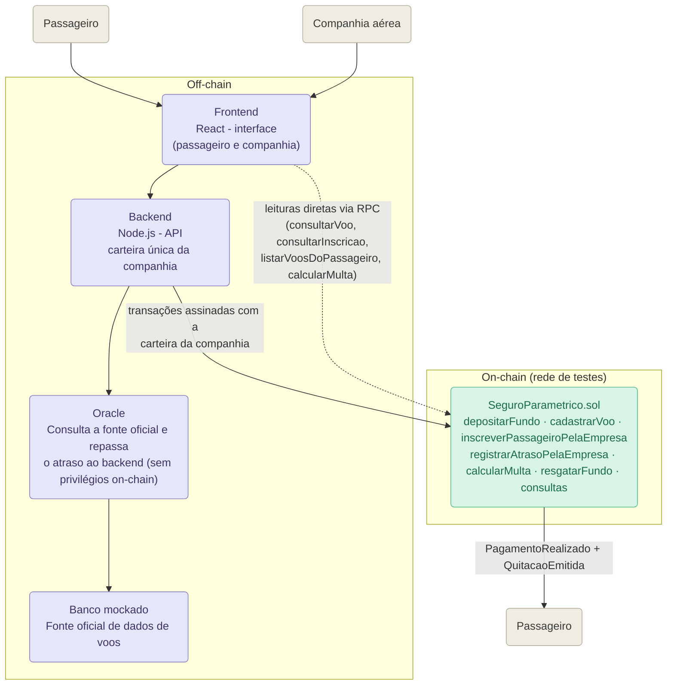

# Diagrama de arquitetura

Versão em Mermaid do diagrama original do grupo (`arquiteturaBase.jpeg`),
atualizada com os nomes e funções que estão implementados. O Oracle é um
componente off-chain, junto com o frontend, o backend e o banco mockado: ele
consulta a fonte oficial dos dados do voo e repassa o atraso ao backend, mas
não possui nenhum privilégio no `SeguroParametrico.sol` e não assina
transações. Quem escreve no contrato é a carteira única da companhia aérea,
operada pelo backend.

A seta cheia entre `Backend` e `SeguroParametrico.sol` representa as
transações assinadas com a chave da companhia (`OPERATOR_PRIVATE_KEY`): fundo
de garantia, cadastro de voo, inscrição de passageiro e registro de atraso. A
seta tracejada entre `Frontend` e o contrato representa **leituras** feitas
direto por RPC (`VITE_RPC_URL` + `VITE_CONTRACT_ADDRESS`), que não exigem
carteira nem extensão no navegador.

## Observação sobre a posição do Oracle no diagrama

O módulo `oracle/oracle.js` é um componente off-chain executado como
serviço/script Node.js. Ele consulta a fonte de dados dos voos e atua como
ponte de comunicação entre os dados externos e o sistema. Ele não é um smart
contract e não possui privilégios especiais no `SeguroParametrico.sol`: não
tem endereço cadastrado no contrato, não passa por nenhum modifier de acesso
e não assina nenhuma transação. O valor que ele apura entra na blockchain
dentro da transação que a companhia assina.

## Observação sobre os dois perfis no mesmo frontend

O mesmo Frontend React atende os dois atores. A companhia o usa para
depositar/resgatar o fundo, cadastrar voos e inscrever passageiros; o
passageiro o usa para consultar voos, ver o atraso oficial apurado pelo
Oracle e confirmar a solicitação de indenização. Nenhum dos dois lida com
carteira ou assinatura no navegador: as transações saem do backend, e as
consultas são leituras públicas do contrato.

Este arquivo é a versão "wrapada" em Markdown do arquivo-fonte
[`diagrama-arquitetura-base.mmd`](./diagrama-arquitetura-base.mmd), mantido
separado para quem preferir importar o Mermaid puro em outra ferramenta (por
exemplo, o [mermaid.live](https://mermaid.live)).

O passo a passo completo de uma chamada — quem envia cada mensagem e em que
ordem — está no diagrama de sequência, em
[`arquitetura.md`](./arquitetura.md). A implantação do contrato na rede de
testes está em [`deploy.md`](./deploy.md).

## Configuração de armazenamento

Ficam on-chain:

- identificador numérico do voo, horário de partida e horário de chegada;
- endereço da companhia e endereços dos passageiros inscritos no voo;
- atraso informado (livre, sem efeito no pagamento) e atraso oficial
  (usado no cálculo) registrados por cada passageiro;
- saldo de garantia de cada companhia;
- indicação de solicitação (`registrado`) e de pagamento (`pago`) por
  passageiro;
- eventos de depósito, cadastro, inscrição, atraso, pagamento, recusa de
  pagamento e quitação.

Ficam off-chain:

- origem, destino e demais informações operacionais do voo (além do horário,
  que é on-chain);
- dados pessoais e documentos do passageiro (nome e vínculo nome↔endereço
  ficam no banco do backend);
- backend (`backend/`), responsável pela orquestração da API e pela carteira
  da companhia;
- frontend, com a interface e as regras de apresentação;
- banco mockado, posteriormente substituível por uma API de voos;
- Oracle (`oracle/oracle.js`), responsável por consultar a fonte oficial e
  repassar o atraso ao backend — não guarda nenhuma chave usada para assinar
  transações do contrato, pois não escreve na blockchain.

Essa divisão mantém na blockchain apenas os dados necessários à execução e à
auditoria, reduzindo custo e evitando a exposição de dados pessoais.

## Decisões arquiteturais

- **Um único contrato:** fundo, regra paramétrica e quitação permanecem juntos
  para reduzir o número de implantações e facilitar a demonstração.
- **Oracle separado do backend, sem privilégios on-chain:** o Oracle continua
  sendo um componente distinto do backend, mas atua apenas como ponte de
  integração — consulta a fonte oficial de dados do voo e repassa o atraso ao
  backend. Ele não possui endereço cadastrado no contrato, não tem nenhuma
  função restrita a ele e não assina transações.
- **Passageiro sem chave privada:** o passageiro informa apenas o endereço que
  recebe a indenização. Isso elimina a necessidade de MetaMask na demonstração
  e é o motivo de o contrato expor
  `inscreverPassageiroPelaEmpresa`/`registrarAtrasoPelaEmpresa` em vez de
  funções assinadas pelo beneficiário.
- **O atraso oficial nunca vem do beneficiário:** o backend relê o Oracle
  antes de assinar e descarta o valor enviado pelo navegador. Não existe
  função pública em que o passageiro informe o próprio atraso oficial, porque
  ela permitiria sacar o fundo da companhia com um número inventado.
- **Voo com múltiplos passageiros:** cada voo pode ter vários passageiros
  inscritos; cada inscrição é registrada e paga de forma independente das
  demais.
