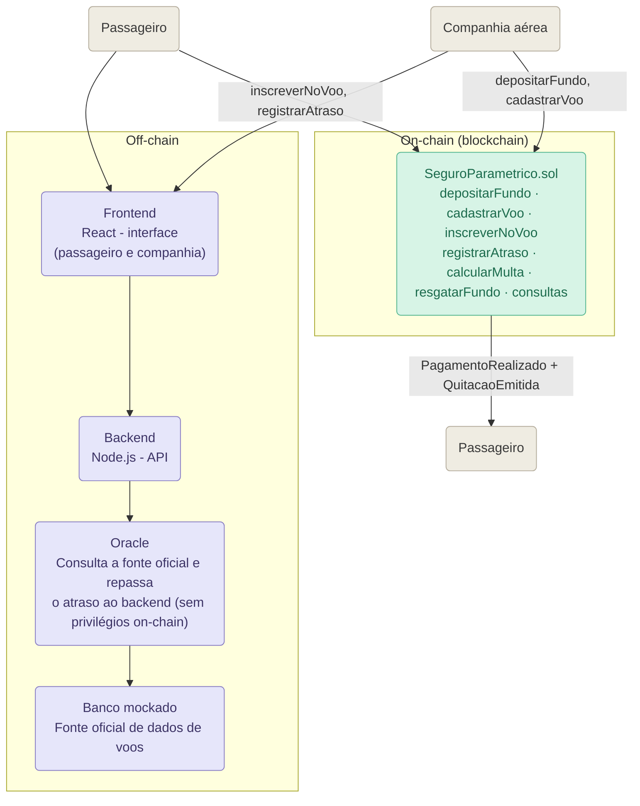

# Diagrama de arquitetura

Versão em Mermaid do diagrama original do grupo (`arquiteturaBase.jpeg`),
atualizada com os nomes e funções que estão sendo implementados. O Oracle é
um componente off-chain, junto com o frontend, o backend e o banco mockado:
ele consulta a fonte oficial dos dados do voo e repassa o atraso ao backend,
mas não possui nenhum privilégio no `SeguroParametrico.sol` e não assina
transações. Quem escreve no contrato são as próprias carteiras da companhia
e do passageiro.

As chamadas apontadas diretamente para `SeguroParametrico.sol`
(`depositarFundo`, `cadastrarVoo`, `inscreverNoVoo` e `registrarAtraso`)
representam transações assinadas pela carteira conectada do próprio ator — a
companhia ou o passageiro — nunca pelo backend ou pelo Oracle.

## Observação sobre a posição do Oracle no diagrama

O módulo `oracle/oracle.js` é um componente off-chain executado como
serviço/script Node.js. Ele consulta a fonte de dados dos voos e atua como
ponte de comunicação entre os dados externos e o sistema. Ele não é um smart
contract e não possui privilégios especiais no `SeguroParametrico.sol`: não
tem endereço cadastrado no contrato, não passa por nenhum modifier de acesso
e não assina nenhuma transação. As transações on-chain são executadas pelas
próprias carteiras das partes envolvidas — a companhia chama
`cadastrarVoo`/`depositarFundo`, e o passageiro chama `inscreverNoVoo` e
`registrarAtraso`.

## Observação sobre o frontend da companhia aérea

O mesmo Frontend React atende os dois atores externos. O passageiro o usa
para informar o voo; a companhia o usa para consultar saldo/voos e para
disparar o `depositarFundo()`. Por isso existe uma seta de `Companhia` para
`Frontend` (interação off-chain, pela interface) além da seta de `Companhia`
direto para `SeguroParametrico.sol` (a transação de depósito em si, que é
assinada pela carteira da companhia e vai direto para a blockchain).

Este arquivo é a versão "wrapada" em Markdown do arquivo-fonte
[`diagrama-arquitetura-base.mmd`](./diagrama-arquitetura-base.mmd), mantido
separado para quem preferir importar o Mermaid puro em outra ferramenta (por
exemplo, o [mermaid.live](https://mermaid.live)).

O passo a passo completo de uma chamada — quem envia cada mensagem e em que
ordem — está no diagrama de sequência, em
[`arquitetura.md`](./arquitetura.md).

## Configuração de armazenamento

Ficam on-chain:

- identificador numérico do voo, horário de partida e horário de chegada;
- endereço da companhia e endereços dos passageiros inscritos no voo;
- atraso informado (livre, sem efeito no pagamento) e atraso oficial
  (usado no cálculo) registrados por cada passageiro;
- saldo de garantia de cada companhia;
- indicação de pagamento por passageiro;
- eventos de depósito, cadastro, inscrição, atraso, pagamento e quitação.

Ficam off-chain:

- origem, destino e demais informações operacionais do voo (além do horário,
  que é on-chain);
- dados pessoais e documentos do passageiro;
- backend (`backend/server.js`), responsável só pela orquestração da API;
- frontend, com a interface e as regras de apresentação;
- banco mockado, posteriormente substituível por uma API de voos;
- Oracle (`oracle/oracle.js`), responsável por consultar a fonte oficial e
  repassar o atraso ao backend — não guarda nenhuma chave usada para assinar
  transações do contrato, pois não escreve na blockchain.

Essa divisão mantém na blockchain apenas os dados necessários à execução e à
auditoria, reduzindo custo e evitando a exposição de dados pessoais.

## Decisões arquiteturais

- **Um único contrato:** fundo, regra paramétrica e quitação permanecem juntos
  para reduzir o número de implantações e facilitar a demonstração.
- **Oracle separado do backend, sem privilégios on-chain:** o Oracle continua
  sendo um componente distinto do backend, mas atua apenas como ponte de
  integração — consulta a fonte oficial de dados do voo e repassa o atraso ao
  backend. Ele não possui endereço cadastrado no contrato, não tem nenhuma
  função restrita a ele e não assina transações.
- **Cada ator assina a própria transação:** a companhia chama
  `depositarFundo` e `cadastrarVoo` com a própria carteira; o passageiro
  chama `inscreverNoVoo` e `registrarAtraso` com a própria carteira. Nem o
  backend nem o Oracle executam transações em nome de outros atores.
- **Voo com múltiplos passageiros:** como a companhia não vincula mais um
  passageiro específico ao cadastrar o voo, cada voo pode ter vários
  passageiros inscritos; cada um só recebe indenização quando ele próprio
  chama `registrarAtraso`, de forma independente dos demais inscritos.

Este diagrama é uma versão preliminar. Durante próximas entregas iremos
incorporar o frontend, testes, evidências de implantação e as
mudanças arquiteturais analisadas durante o desenvolvimento.
