# Diagrama de classes dos contratos inteligentes

Há apenas um smart contract nesta versão: `SeguroParametrico`. `Voo` e
`Inscricao` são as structs que ele usa internamente: `Voo` guarda os dados do
voo cadastrado pela companhia, e `Inscricao` guarda, para cada par
(voo, passageiro), o estado individual de inscrição, atraso e pagamento. O
diagrama abaixo mostra só os elementos que existem dentro do Solidity —
contrato, structs, atributos, funções e as relações de composição entre eles.

A interação do contrato com o backend e com componentes off-chain (incluindo
o Oracle, que atua como ponte de integração) está descrita nos diagramas de
arquitetura, não aqui: veja
[`diagrama-arquitetura-base.mmd`](./diagrama-arquitetura-base.mmd) para a visão
de componentes e [`arquitetura.md`](./arquitetura.md) para o diagrama de
sequência do fluxo completo.

```mermaid
classDiagram
    direction LR

    class SeguroParametrico {
        <<contract>>
        +uint256 LIMIAR_ATRASO_HORAS$
        +uint256 VALOR_MULTA$
        -Map~address,uint256~ fundosEmpresas
        -Map~uint256,Voo~ voos
        -Map~uint256,Map~address,Inscricao~~ inscricoes
        -Map~address,uint256[]~ voosPorEmpresa
        -Map~address,uint256[]~ voosPorPassageiro
        +SeguroParametrico()
        +depositarFundo() payable
        +cadastrarVoo(uint256 vooId, uint256 horarioPartida, uint256 horarioChegada)
        +inscreverNoVoo(uint256 vooId)
        +registrarAtraso(uint256 vooId, uint256 atrasoHorasInformado, uint256 atrasoHorasOficial) bool pagamentoEfetuado, string mensagem
        +calcularMulta(uint256 atrasoHoras) uint256
        +resgatarFundo(uint256 valor)
        +consultarSaldo(address empresa) uint256
        +consultarVoo(uint256 vooId) Voo
        +consultarInscricao(uint256 vooId, address passageiro) Inscricao
        +listarVoosDaEmpresa(address empresa) uint256[]
        +listarVoosDoPassageiro(address passageiro) uint256[]
    }

    class Voo {
        <<struct>>
        +uint256 id
        +address empresa
        +uint256 horarioPartida
        +uint256 horarioChegada
        +uint256 totalPassageiros
    }

    class Inscricao {
        <<struct>>
        +bool inscrito
        +uint256 atrasoHorasInformado
        +uint256 atrasoHorasOficial
        +bool pago
    }

    SeguroParametrico "1" *-- "0..*" Voo : armazena em voos
    SeguroParametrico "1" *-- "0..*" Inscricao : armazena em inscricoes

    note for SeguroParametrico "cadastrarVoo usa msg.sender como empresa; inscreverNoVoo e registrarAtraso usam msg.sender como o proprio passageiro. Cada voo pode ter varios passageiros inscritos, mas cada Inscricao e paga de forma independente. O Oracle nao faz parte da estrutura interna do contrato, pois e um componente off-chain sem privilegios aqui."
```

`$` marca `LIMIAR_ATRASO_HORAS` e `VALOR_MULTA` como membros `constant`, ou
seja, compartilhados pelo contrato e não por instância — na prática, como só
existe um deploy do contrato, isso não muda o comportamento, mas reflete a
declaração Solidity (`constant`).

## Atributos

| Atributo | Tipo | Visibilidade | Papel |
|---|---|---|---|
| `LIMIAR_ATRASO_HORAS` | `uint256` | `public constant` | Atraso mínimo (em horas) que gera indenização. |
| `VALOR_MULTA` | `uint256` | `public constant` | Valor fixo pago ao passageiro quando a indenização é devida. |
| `fundosEmpresas` | `mapping(address => uint256)` | `private` | Saldo de garantia depositado por cada companhia. |
| `voos` | `mapping(uint256 => Voo)` | `private` | Registro de cada voo pelo seu ID. |
| `inscricoes` | `mapping(uint256 => mapping(address => Inscricao))` | `private` | Estado de cada passageiro dentro de um voo. |
| `voosPorEmpresa` | `mapping(address => uint256[])` | `private` | Índice reverso: voos cadastrados por cada companhia. |
| `voosPorPassageiro` | `mapping(address => uint256[])` | `private` | Índice reverso: voos em que cada passageiro se inscreveu. |

## Funções

| Função | Quem chama | Efeito no estado |
|---|---|---|
| `depositarFundo()` | Companhia | Soma `msg.value` ao saldo da companhia em `fundosEmpresas`. |
| `cadastrarVoo(vooId, horarioPartida, horarioChegada)` | Companhia | Cria a entrada `voos[vooId]` e a adiciona a `voosPorEmpresa[msg.sender]`. |
| `inscreverNoVoo(vooId)` | Passageiro | Cria `inscricoes[vooId][msg.sender]`, incrementa `totalPassageiros` e adiciona o voo a `voosPorPassageiro[msg.sender]`. |
| `registrarAtraso(vooId, atrasoHorasInformado, atrasoHorasOficial)` | Passageiro | Atualiza a `Inscricao` do próprio `msg.sender`; se a multa (calculada sobre `atrasoHorasOficial`) for devida e houver saldo, debita `fundosEmpresas[empresa]`, marca `pago = true` e transfere ETH a esse passageiro. `atrasoHorasInformado` fica apenas registrado, sem efeito no cálculo. |
| `calcularMulta(atrasoHoras)` | Qualquer um (`pure`) | Não altera estado; retorna `VALOR_MULTA` ou `0`. |
| `resgatarFundo(valor)` | Companhia | Reduz `fundosEmpresas[msg.sender]` e devolve ETH a ela. |
| `consultarSaldo(empresa)` | Qualquer um (`view`) | Leitura de `fundosEmpresas`. |
| `consultarVoo(vooId)` | Qualquer um (`view`) | Leitura de `voos`. |
| `consultarInscricao(vooId, passageiro)` | Qualquer um (`view`) | Leitura de `inscricoes`. |
| `listarVoosDaEmpresa(empresa)` | Qualquer um (`view`) | Leitura de `voosPorEmpresa`. |
| `listarVoosDoPassageiro(passageiro)` | Qualquer um (`view`) | Leitura de `voosPorPassageiro`. |

## Relação entre as classes

`SeguroParametrico` **compõe** `Voo` e `Inscricao`: nenhuma das duas structs
existe fora dos mappings do contrato (`voos` e `inscricoes`), por isso a
composição `*--`, e não uma simples associação. Um `Voo` pode estar associado
a várias `Inscricao` (uma por passageiro), mas cada `Inscricao` é resolvida
de forma independente — o pagamento de um passageiro não depende do estado
dos demais inscritos no mesmo voo.

## Eventos

- `FundoDepositado`: comprova a entrada de garantia da companhia.
- `VooCadastrado`: registra o cadastro do voo pela companhia, com seus horários.
- `PassageiroInscrito`: registra a autoinscrição de um passageiro em um voo.
- `AtrasoRegistrado`: registra o atraso informado e o atraso oficial
  confirmados pelo passageiro na transação on-chain.
- `PagamentoRealizado`: registra a transferência ao passageiro.
- `QuitacaoEmitida`: produz a evidência auditável da quitação.
- `FundoResgatado`: dá transparência ao resgate de saldo pela companhia.

O contrato aplica *checks-effects-interactions*: reduz o saldo e marca a
inscrição como paga antes da chamada externa que transfere a indenização.
