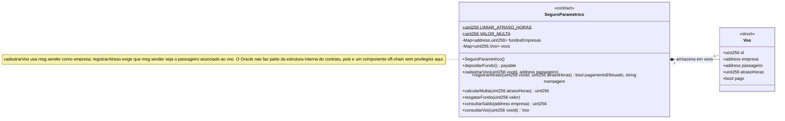

# Diagrama de classes dos contratos inteligentes

Há apenas um smart contract nesta versão: `SeguroParametrico`. `Voo` é a
struct que ele usa internamente para guardar cada apólice/voo monitorado. O
diagrama abaixo mostra só os elementos que existem dentro do Solidity —
contrato, struct, atributos, funções e a relação de composição entre eles.

A interação do contrato com o backend e com componentes off-chain (incluindo
o Oracle, que atua como ponte de integração) está descrita nos diagramas de
arquitetura, não aqui: veja
[`diagrama-arquitetura-base.mmd`](./diagrama-arquitetura-base.mmd) para a visão
de componentes e [`arquitetura.md`](./arquitetura.md) para o diagrama de
sequência do fluxo completo.

`$` marca `LIMIAR_ATRASO_HORAS` e `VALOR_MULTA` como membros `constant`, ou
seja, compartilhados pelo contrato e não por instância — na prática, como só
existe um deploy do contrato, isso não muda o comportamento, mas reflete a
declaração Solidity (`constant`).

## Atributos

| Atributo | Tipo | Visibilidade | Papel |
|---|---|---|---|
| `LIMIAR_ATRASO_HORAS` | `uint256` | `public constant` | Atraso mínimo (em horas) que gera indenização. |
| `VALOR_MULTA` | `uint256` | `public constant` | Valor fixo pago ao passageiro quando a indenização é devida. |
| `fundosEmpresas` | `mapping(address => uint256)` | `private` | Saldo de garantia depositado por cada companhia. |
| `voos` | `mapping(uint256 => Voo)` | `private` | Registro de cada voo/apólice pelo seu ID. |

## Funções

| Função | Quem chama | Efeito no estado |
|---|---|---|
| `depositarFundo()` | Companhia | Soma `msg.value` ao saldo da companhia em `fundosEmpresas`. |
| `cadastrarVoo(vooId, passageiro)` | Companhia | Cria a entrada `voos[vooId]` — chamada pela carteira da companhia. |
| `registrarAtraso(vooId, atrasoHoras)` | Passageiro | Atualiza `atrasoHoras`; se a multa for devida e houver saldo, debita `fundosEmpresas[empresa]`, marca `pago = true` e transfere ETH ao passageiro. |
| `calcularMulta(atrasoHoras)` | Qualquer um (`pure`) | Não altera estado; retorna `VALOR_MULTA` ou `0`. |
| `resgatarFundo(valor)` | Companhia | Reduz `fundosEmpresas[msg.sender]` e devolve ETH a ela. |
| `consultarSaldo(empresa)` | Qualquer um (`view`) | Leitura de `fundosEmpresas`. |
| `consultarVoo(vooId)` | Qualquer um (`view`) | Leitura de `voos`. |

## Relação entre as classes

`SeguroParametrico` **compõe** `Voo`: cada `Voo` só existe dentro do mapping
`voos` do contrato, não há instância de `Voo` fora dele (por isso a
composição `*--`, e não uma simples associação). É a única relação estrutural
do diagrama porque o protótipo tem um único contrato.

## Eventos

- `FundoDepositado`: comprova a entrada de garantia da companhia.
- `AtrasoRegistrado`: registra o atraso informado pelo passageiro na
  transação on-chain.
- `PagamentoRealizado`: registra a transferência ao passageiro.
- `QuitacaoEmitida`: produz a evidência auditável da quitação.
- `VooCadastrado` e `FundoResgatado`: dão transparência às operações
  auxiliares necessárias ao protótipo.

O contrato aplica *checks-effects-interactions*: reduz o saldo e marca o voo
como pago antes da chamada externa que transfere a indenização.
