# Diagrama de classes

Estrutura do `SeguroVoo.sol`: estado, tipos e funções, agrupados por quem pode
chamá-las.

```mermaid
classDiagram
    class SeguroVoo {
        <<contract>>
        +uint256 LIMIAR_ATRASO_HORAS = 4
        +uint256 VALOR_INDENIZACAO = 0.5 ether
        +uint256 VALOR_INDENIZACAO_CENTAVOS = 50000
        +address oraculo
        +address tjpb
        +address plataforma
        -mapping~bytes32,Voo~ voos
        -mapping~bytes32,Bilhete~ bilhetes
        -mapping~bytes32,bytes32[]~ bilhetesDoVoo
        -mapping~bytes32,bytes32[]~ bilhetesDoCpf
        -mapping~address,bytes32[]~ voosDaCompanhia
        -bytes32[] todosOsVoos
        +mapping~bytes32,address~ carteiraDoCpf
        +mapping~bytes32,uint256~ creditoRetido
        +mapping~bytes32,uint256~ totalDepositado
        +mapping~address,uint256~ saldoLiberado
        %% -- Companhia aérea --
        +cadastrarVoo(codigo, partida, chegada) bytes32
        +registrarBilhete(codigo, hashCpf) payable bytes32
        +resgatarGarantias(valor)
        %% -- Oráculo --
        +reportarChegada(codigo, chegadaReal) StatusVoo
        %% -- Plataforma --
        +vincularCarteira(hashCpf, carteira) uint256
        %% -- Titular da carteira ou plataforma --
        +sacarCreditoRetido(hashCpf) uint256
        %% -- Interno --
        -_indenizar(bilheteId, atrasoMinutos)
        -_devolverGarantia(bilheteId, companhia)
        %% -- Leitura: qualquer um, inclusive o TJPB --
        +regraContrato() view
        +consultarVoo(vooId) view Voo
        +consultarBilhete(bilheteId) view Bilhete
        +listarTodosOsVoos() view bytes32[]
        +listarBilhetesDoVoo(vooId) view bytes32[]
        +listarBilhetesDoCpf(hashCpf) view bytes32[]
        +listarVoosDaCompanhia(companhia) view bytes32[]
        +resumoDoCpf(hashCpf) view
        +saldoCustodiado() view uint256
        +idDoVoo(codigo) pure bytes32
        +idDoBilhete(codigo, hashCpf) pure bytes32
    }

    class Voo {
        <<struct>>
        string codigo
        address companhia
        uint64 partidaPrevista
        uint64 chegadaPrevista
        uint64 chegadaReal
        uint32 atrasoMinutos
        StatusVoo status
        uint32 totalBilhetes
    }

    class Bilhete {
        <<struct>>
        bytes32 id
        bytes32 vooId
        bytes32 hashCpf
        uint256 garantia
        StatusBilhete status
        uint64 quitadoEm
    }

    class StatusVoo {
        <<enum>>
        Agendado
        Pontual
        Atrasado
    }

    class StatusBilhete {
        <<enum>>
        Ativo
        Indenizado
        GarantiaLiberada
    }

    SeguroVoo "1" *-- "0..*" Voo
    SeguroVoo "1" *-- "0..*" Bilhete
    Voo "1" o-- "0..*" Bilhete : bilhetesDoVoo
    Voo ..> StatusVoo
    Bilhete ..> StatusBilhete
```

## Eventos

Os eventos são a fonte dos logs do sistema e do painel de auditoria do TJPB.

| Evento | Quando | Para quê |
|---|---|---|
| `VooCadastrado` | Companhia cadastra o voo | Registro do contrato de voo |
| `BilheteRegistrado` | Passageiro embarcado | Prova do depósito da garantia |
| `ChegadaReportada` | Oráculo apura | Status do voo e atraso oficial |
| `IndenizacaoDepositada` | Pagamento efetivado | Confirmação de pagamento |
| `IndenizacaoRetida` | CPF sem cadastro | Valor reservado, não perdido |
| `QuitacaoEmitida` | Junto ao pagamento | Termo de quitação dos danos materiais |
| `GarantiaLiberadaParaCompanhia` | Voo no prazo | Garantia devolvida |
| `CarteiraVinculada` | Cliente se cadastra | Vínculo CPF ↔ carteira, com o valor pendente |
| `CreditoRetidoSacado` | Cliente saca o pendente | Fim da pendência: daí em diante é automático |
| `GarantiaResgatada` | Companhia saca | Saída de valor para a companhia |

## Controle de acesso

| Função | Quem pode chamar | Como o contrato garante |
|---|---|---|
| `cadastrarVoo` | Qualquer companhia | `msg.sender` vira dono do voo |
| `registrarBilhete` | Só a companhia dona do voo | `voo.companhia == msg.sender` |
| `resgatarGarantias` | Só quem tem saldo liberado | `saldoLiberado[msg.sender]` |
| `reportarChegada` | Só o oráculo | `modifier somenteOraculo` |
| `vincularCarteira` | Só a plataforma | `modifier somentePlataforma` |
| `sacarCreditoRetido` | Titular da carteira ou plataforma | `msg.sender == carteiraDoCpf` ou `plataforma` |
| Todas as `view` | Qualquer um, inclusive o TJPB | Sem restrição |

Mesmo `sacarCreditoRetido`, a função menos restrita entre as de escrita, não
permite desviar dinheiro: o destino é sempre `carteiraDoCpf[hashCpf]`, e não
um endereço passado por parâmetro.

O TJPB não aparece em nenhuma linha da coluna de escrita: é a tradução, em
código, do papel de validador que audita sem interferir.
