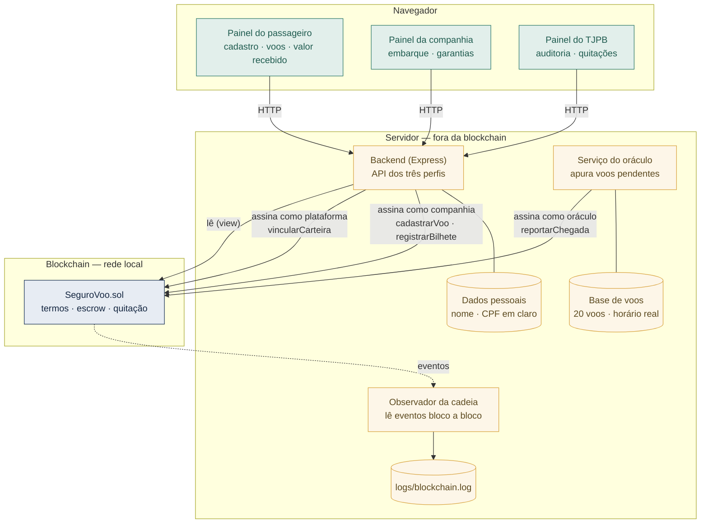

# Diagrama de componentes

Componentes do AcordoInstant e a fronteira entre o que fica na blockchain e o
que fica fora dela.

## O que a fronteira separa

**Fica fora da cadeia:** nome e CPF em claro, a base de horários dos voos e
todo o registro de log. O CPF é a chave do cliente no servidor, mas só o hash
dele cruza a fronteira.

**Vai para a cadeia:** os termos do contrato, a identificação do bilhete (um
hash), o status apurado do voo, a confirmação do pagamento e o termo de
quitação.

## Quem assina o quê

Cada seta de escrita sai de uma carteira diferente, e o contrato recusa a
combinação errada. A companhia não consegue reportar um atraso; o oráculo não
consegue embarcar passageiros; o TJPB não tem nenhuma seta de escrita.
