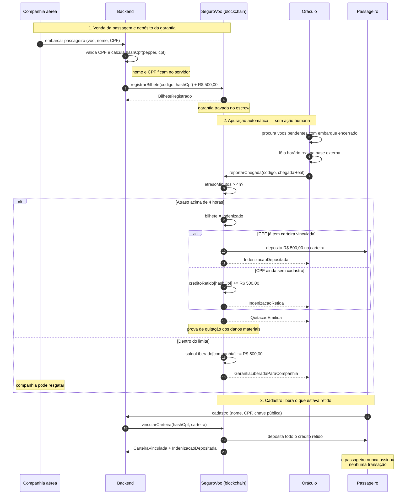

# Diagrama de sequência

O caminho completo, do embarque ao depósito — incluindo o caso em que o
passageiro ainda não é usuário da plataforma quando o voo atrasa.

## Pontos de atenção

**O passageiro não aparece assinando nada.** Ele só recebe. Não existe função
de saque para ele no contrato — apenas depósito.

**A apuração e o pagamento são a mesma transação.** `reportarChegada` percorre
todos os bilhetes do voo e resolve cada um; não há um segundo passo que possa
ficar pendente.

**O dinheiro não se perde se o passageiro não existir no sistema.** Ele fica
reservado ao hash do CPF por tempo indeterminado, e o cadastro é o gatilho que
o libera.
